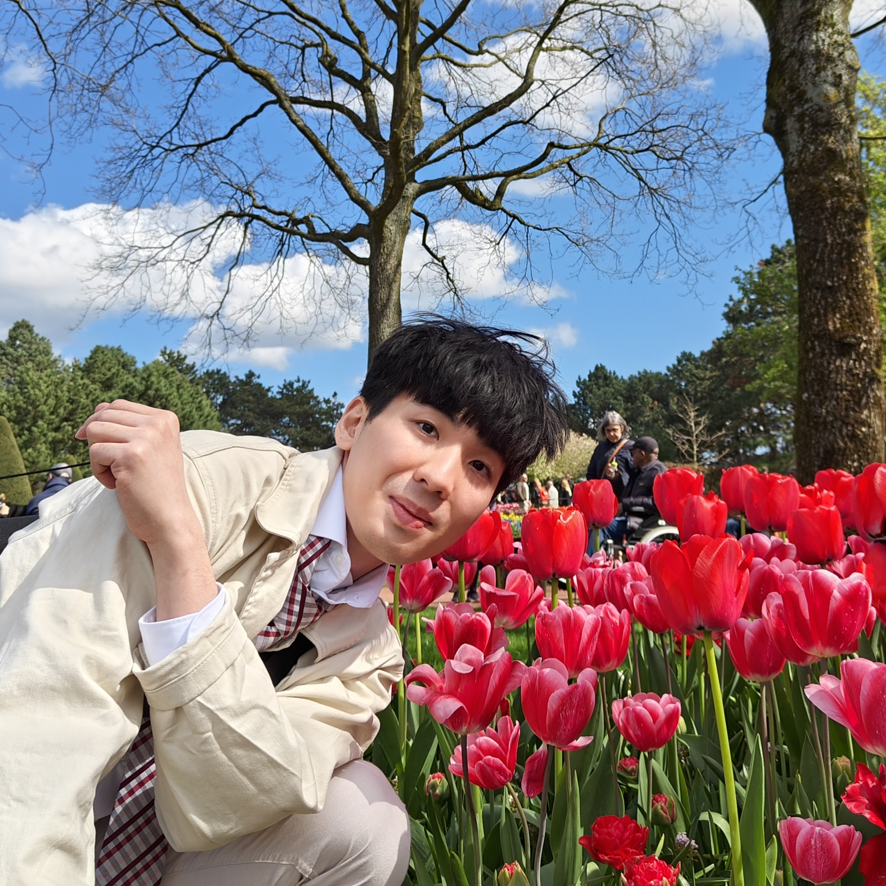

::: {.grid .about-hero}
::: {.g-col-12 .g-col-lg-8 .about-hero-copy}
# Tzu-Yao Lin

I am a quantitative psychologist and joint PhD candidate at KU Leuven and Maastricht University. My work starts from a deceptively simple question: when measurements are repeated across moments, days, and people, what should count as reliable? Many familiar indices depend on choices about the level, timescale, and comparison that define reliability, yet these choices are often left implicit. I work on making them explicit and developing more systematic procedures for constructing and evaluating measurement indices.

My broader interests include longitudinal and multilevel modeling, as well as mathematical and computational models of judgment and decision-making. Outside research, I am a fire dancer and Lindy hopper.

::: {.about-links}
[<i class="bi bi-file-person-fill"></i> CV](https://xup6y3ul6.github.io/CV/TzuYaoLin_CV.pdf){.about-link}
[ ORCID](https://orcid.org/0000-0002-2261-448X){.about-link}
[<i class="bi bi-linkedin"></i> LinkedIn](https://www.linkedin.com/in/tzu-yao-nick-lin/){.about-link}
[<i class="bi bi-envelope-at-fill"></i> Email](mailto:tzu-yao.lin@maastrichtuniversity.nl){.about-link}
:::
:::

::: {.g-col-12 .g-col-lg-4 .about-hero-media}

:::
:::

## Research focus

::: {.about-list}
### Reliability and measurement

How the meaning and estimation of reliability change when data include multiple levels, repeated observations, or temporal dependence.

### Longitudinal and multilevel modeling

Statistical models for intensive longitudinal and hierarchical data, including mixed-effects and autoregressive structures.

### Mathematical and computational modeling

Models of judgment and decision-making, including cultural consensus and threshold models.
:::

## Background

::: {.about-list .about-background-list}
### Joint PhD candidate

**2022 — Present**

KU Leuven · Research Group of Quantitative Psychology and Individual Differences

Maastricht University · Department of Methodology and Statistics

### MS in Psychology

**2019 — 2022**

National Taiwan University · Department of Psychology

### BS in Psychology, minor in Forestry

**2014 — 2019**

National Taiwan University · Department of Psychology

Minor: School of Forestry and Resource Conservation
:::
