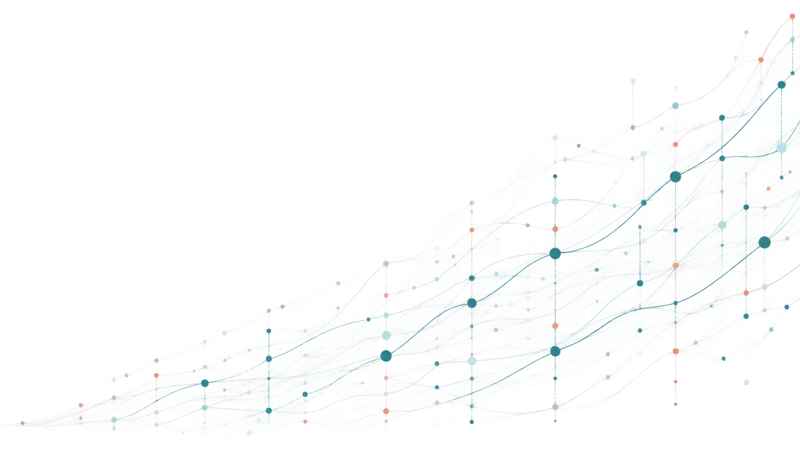

```{=html}
<div class="home-shell">
  <section class="home-hero" aria-labelledby="home-hero-title">
    <div class="hero-copy">
      <h1 id="home-hero-title">Hi, I'm Tzu-Yao.</h1>
      <p class="hero-statement">I study <span class="gradient-text">reliability</span> in multilevel and <span class="gradient-text">intensive longitudinal data</span>.</p>
      <p class="hero-affiliation">Joint PhD researcher <span aria-hidden="true">·</span> KU Leuven <span aria-hidden="true">×</span> Maastricht University</p>
      <div class="hero-actions" aria-label="Primary links">
        <a class="hero-button hero-button-primary" href="publication.qmd">
          <span>View publications</span>
          <i class="bi bi-arrow-right" aria-hidden="true"></i>
        </a>
        <a class="hero-button hero-button-secondary" href="https://xup6y3ul6.github.io/CV/TzuYaoLin_CV.pdf">
          <span>Download CV</span>
          <i class="bi bi-download" aria-hidden="true"></i>
        </a>
      </div>
    </div>

    <div class="hero-visual" aria-hidden="true">
      
      <canvas class="trajectory-particles"></canvas>
    </div>
  </section>
</div>
<script src="home.js"></script>
```
