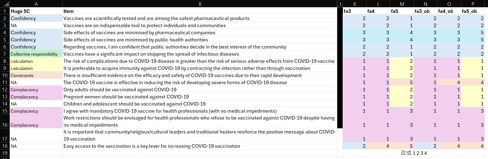

::: callout-note
## About this analysis record

This page documents exploratory analyses conducted during the preparation of a collaborative study of vaccine sentiment among Brazilian healthcare workers. It is retained as a public record of the analytical workflow and is not intended as a complete tutorial or as the definitive report of the study.

The final methods, results, and interpretations are reported in [Lo et al. (2025), *The impact of the COVID-19 pandemic on vaccine sentiment among Brazilian healthcare workers: A cross-sectional online survey study*](https://doi.org/10.7189/001c.144190).
:::

This page focuses on two parts of the analytical workflow:

1. Exploring whether the factor structure of 17 vaccine-attitude items could be interpreted in relation to the 5C model of vaccine hesitancy.
2. Fitting logistic regression models that used the resulting factor scores and other covariates to examine associations with five vaccine-sentiment outcomes.

The page does not document every analysis reported in the published article. Some sections preserve intermediate model comparisons and working decisions made during manuscript development.

The participant-level dataset is restricted and is not distributed with this website. The code and frozen aggregate outputs are retained to document the analytical workflow. Consequently, this page supports transparency about the analysis process but is not a fully executable public reproduction package.

# Data preparation

First, the necessary R packages are loaded.

```{r}
#| label: load-packages
 
library(tidyverse)
library(ggplot2)
library(haven) # for reading STATA dta files
library(psych) # for factor analysis
library(GPArotation)
library(corrplot) # for correlation plots
library(gt)
```

The analysis uses a restricted participant-level dataset that is stored separately from this public repository. Authorised researchers can supply its external file path through the `BRAZIL_DATA_PATH` environment variable.

```{r}
#| label: load-data

data_path <- Sys.getenv("BRAZIL_DATA_PATH")

if (!nzchar(data_path)) {
  stop("Set BRAZIL_DATA_PATH to the restricted dataset outside this project.")
}

data_path <- normalizePath(data_path, mustWork = TRUE)
project_dir <- Sys.getenv(
  "QUARTO_PROJECT_DIR",
  unset = normalizePath("../../..", mustWork = TRUE)
)
project_dir <- normalizePath(project_dir, mustWork = TRUE)

if (
  identical(data_path, project_dir) ||
    startsWith(data_path, paste0(project_dir, .Platform$file.sep))
) {
  stop("BRAZIL_DATA_PATH must point outside the public website project.")
}

rawdata <- read_dta(data_path) |>
  select(
    gender, age_class, member, edu, prof, w_setting, chronic,
    matches("vac_gen_\\d"),
    covid_pro_1:covid_oblig_2,
    covid_leaders:covid_earlyaccess,
    cov_pro_3, change_vac_1, change_vac_2, change_vac_3,
    change_HealthSy_1, fear, knowledge
  )
```

Only variables required by the analyses below are retained in memory. Direct identifiers, network identifiers, precise timestamps, and free-text responses are excluded.

Key observations from the data preparation include:

- Missing values are present, denoted by `NA` for numeric variables and empty strings ("") for character variables.
- Many variables have the class `haven_labelled`. These labelled variables require careful handling and appropriate transformation before analysis.

Next, the variables relevant to this analysis are selected.

```{r}
data <- rawdata |>
  mutate(across(where(is.character), ~ na_if(., "")))
```

# Vaccine hesitancy (VH)

## Prepare variables

Before conducting the factor analysis, 17 variables related to general vaccine attitudes and specific COVID-19 attitudes were selected.

```{r}
#| label: 5C 

fa_data <- data |>
  select(matches("vac_gen_\\d"), covid_pro_1:covid_oblig_2, covid_leaders:covid_earlyaccess) |> 
  drop_na()

apply(fa_data, 2, table)
```

::: callout-warning
Caution that the numeric labels for the Likert scale responses ('Strongly Disagree,' 'Disagree,' 'Agree,' 'Strongly Agree') are coded as 1, 2, 4, and 5, respectively, rather than the more common sequential coding (e.g., 1, 2, 3, 4)

This non-sequential coding implies an assumption that the interval between 'Disagree' (2) and 'Agree' (4) is twice that of the other adjacent intervals. Treating these data as interval scale in the analysis relies on this assumption.

The Pearson correlations and maximum-likelihood factor models below therefore treat the recoded four-point responses as approximately continuous.
:::

Following the coding used in the study, these responses were recoded from 1, 2, 4, and 5 to 1, 2, 3, and 4.

In addition, observations with missing values in any of these 17 variables were removed. Consequently, `{r} nrow(fa_data)` complete observations remain for the factor analysis.

```{r}
#| label: 5C-relabel

fa_data <- fa_data |> 
  mutate(across(everything(), ~ . - ifelse(. > 3, 1, 0)))

table(fa_data$vac_gen_1) # check an example
```

Before performing the factor analysis, a correlation matrix is examined to visually inspect potential clustering among the attitude variables.

```{r}
#| label: fig-cor-mat
#| fig-cap: Correlation matrix of vaccine-attitude variables

cor_mat <- cor(fa_data)

# Copy from https://www.sthda.com/english/wiki/visualize-correlation-matrix-using-correlogram

cor.mtest <- function(mat, ...) {
    mat <- as.matrix(mat)
    n <- ncol(mat)
    p.mat<- matrix(NA, n, n)
    diag(p.mat) <- 0
    for (i in 1:(n - 1)) {
        for (j in (i + 1):n) {
            tmp <- cor.test(mat[, i], mat[, j], ...)
            p.mat[i, j] <- p.mat[j, i] <- tmp$p.value
        }
    }
  colnames(p.mat) <- rownames(p.mat) <- colnames(mat)
  p.mat
}
# matrix of the p-value of the correlation
p.mat <- cor.mtest(cor_mat)

corrplot(
  cor_mat, method="color", type="upper", order="hclust", 
  addCoef.col = "black", # Add coefficient of correlation
  tl.col="black", tl.srt=45, tl.cex=0.6, #Text label color and rotation
  cl.cex = 0.5, number.cex = 0.75,
  # Combine with significance
  p.mat = p.mat, sig.level = 0.01, insig = "blank", 
  # hide correlation coefficient on the principal diagonal
  diag=FALSE
)
```

::: callout-caution
## Audit note: significance masking in the correlation plot

In this recorded workflow, `cor.mtest()` was applied to `cor_mat` rather than to the original item-level data. The significance masking in the displayed correlation plot should therefore be treated as an exploratory display rather than as a valid set of tests for the original item correlations. The correlation matrix itself and the downstream factor analyses do not depend on `p.mat`.
:::

The correlation matrix suggests potential clustering into two or three groups:

1. `vac_gen_4`, `covid_ag_1`, `covid_ag_2`, and `covid_over18` form a cluster.
2. Other variables (except for `vac_gen_6`) form a cluster.
3. `vac_gen_6` might form its own cluster but appears closer to the second cluster. Subsequent analyses did not identify a distinct factor defined by this item.

Note that this is a preliminary observation based on correlations. The underlying latent structure will be formally investigated using factor analysis.

## Factor analysis

### Pre-tests and scree plots

Kaiser-Meyer-Olkin (KMO) measure and Bartlett's test of sphericity are used to assess the suitability of the data for factor analysis.

::: {.callout-note collapse="true"}
## Interpretation notes: factorability diagnostics

- The Kaiser-Meyer-Olkin (KMO) statistic summarizes whether the pattern of correlations is sufficiently compact for common-factor analysis; larger values indicate greater factorability.
- Bartlett's test evaluates whether the correlation matrix differs from an identity matrix. A small p-value indicates that the items are not mutually uncorrelated, but it does not determine the number of factors or establish that a particular factor solution is appropriate.

:::

```{r}
#| label: fa-pre-test
 
# Kaiser-Meyer-Olkin statistic
KMO_result <- KMO(cor_mat)
print(KMO_result)

# Bartlett's test of sphericity
bartlett_result <- cortest.bartlett(cor_mat, n = nrow(data))
print(bartlett_result)
```

The recorded KMO value and Bartlett test were used at the time as preliminary checks of factorability. These diagnostics do not, by themselves, establish an appropriate dimensional model.

::: callout-caution
## Audit note: sample size in Bartlett's test

The recorded call supplied `nrow(data)` as the sample size, whereas `cor_mat` was calculated from the complete-case dataset `fa_data`. The frozen chi-square statistic is retained here as part of the original workflow, but a reanalysis should use the effective sample size corresponding to the correlation matrix. This issue does not alter the subsequent factor-model estimates, which were fitted directly to `fa_data`.
:::

A key challenge in EFA is determining the optimal number of factors to retain. Parallel analysis is employed to guide the decision on the number of factors. This procedure compares the eigenvalues from the actual data's correlation matrix with eigenvalues derived from random data matrices of the same size. The number of factors suggested is the count of actual eigenvalues that exceed the corresponding eigenvalues (or the 95th percentile thereof) from the random data.

```{r}
#| label: fig-scree
#| fig-cap: "Scree plot of eigenvalues"
 
fa.parallel(fa_data, fm = "ml", fa = "fa", nfactors = 1) 
```

With maximum-likelihood factor analysis specified (`fm = "ml"`), the displayed parallel analysis suggested retaining three factors. This result was treated as one input to the exploratory comparison rather than as a definitive decision. Visual inspection of the scree plot could support a smaller solution, while the Kaiser eigenvalue-greater-than-one rule suggested one factor; the latter was not used as the primary retention criterion.

This analysis does not aim to develop a new measurement instrument or uncover 'true' latent constructs. Instead, the goal is to explore whether the factor structure in this data aligns with the established 5C model. To facilitate comparison with the 5C model, solutions with 3, 4, and 5 factors will be examined. Therefore, 3-, 4-, and 5-factor models are explored below. For each number of factors (3, 4, and 5), both orthogonal ("Varimax") and oblique ("Oblimin") rotations are applied. Factor scores are estimated using the regression method.

::: {.callout-note collapse="true"}
## Interpretation notes: factor solutions

- Factor loadings describe the relation between each item and the factors.
- `h2` is the communality, or the proportion of an item's variance represented by the retained factors; `u2` is its uniqueness (`1 - h2`).
- `com` is Hofmann's item-complexity index. Values near one indicate that an item is primarily associated with one factor, whereas larger values indicate more complex loading patterns.
- Model comparison also considered cross-loadings, factor correlations, simple structure, theoretical interpretability, and the proportion of variance represented. Conventional numerical cutoffs were treated as descriptive guides rather than universal decision rules.

:::

### Orthogonal rotation

::: {.panel-tabset}

## n = 3

```{r}
#| label: fa3-otho

fa3 <- fa(fa_data, nfactors = 3, rotate = "varimax", scores = "regression", fm = "ml")
fa3
```

## n = 4

```{r}
#| label: fa4-otho

fa4 <- fa(fa_data, nfactors = 4, rotate = "varimax", scores = "regression", fm = "ml")
fa4
```

## n = 5

```{r}
#| label: fa5-otho

fa5 <- fa(fa_data, nfactors = 5, rotate = "varimax", scores = "regression", fm = "ml")
fa5
```

:::

::: {.column-page}
```{r}
#| label: fig-fa-otho
#| fig-cap: "Diagram of factor structure under the orthogonal rotation"
#| fig-subcap:
#|   - "n = 3"  
#|   - "n = 4"
#|   - "n = 5"
#| layout-ncol: 3
 
fa.diagram(fa3, sort = FALSE)
fa.diagram(fa4, sort = FALSE)
fa.diagram(fa5, sort = FALSE)
```

:::


### Oblique rotation

::: {.panel-tabset}

## n = 3

```{r}
#| label: fa3-obli

fa3_ob <- fa(fa_data, nfactors = 3, rotate = "oblimin", scores = "regression", fm = "ml")
fa3_ob
```

## n = 4

```{r}
#| label: fa4-obli

fa4_ob <- fa(fa_data, nfactors = 4, rotate = "oblimin", scores = "regression", fm = "ml")
fa4_ob
```

## n = 5

```{r}
#| label: fa5-obli

fa5_ob <- fa(fa_data, nfactors = 5, rotate = "oblimin", scores = "regression", fm = "ml")
fa5_ob
```

:::

I prefer the `fa5_ob` model. However, caution is advised regarding the item complexity (com) values which are larger than 2. This suggests these items load substantially on more than one factor, indicating potential cross-loading. Similar cross-loading issues are observed in other solutions as well.


::: {.column-page}

```{r}
#| label: fig-fa-obli
#| fig-cap: "Diagram of factor structure under the oblique rotation"
#| fig-subcap:
#|   - "n = 3"  
#|   - "n = 4"
#|   - "n = 5" 
#| layout-ncol: 3 
 
fa.diagram(fa3_ob, sort = FALSE)
fa.diagram(fa4_ob, sort = FALSE)
fa.diagram(fa5_ob, sort = FALSE)
```

:::

### Overall comparison

```{r}
#| label: get-loading
 
assign_fac <- function(f){
  fac_load_abs <- abs(f$loadings)
  mac_loadings <- apply(fac_load_abs, 1, which.max)
}

fa_models <- list(fa3, fa4, fa5, fa3_ob, fa4_ob, fa5_ob)
fa_load_comp <- map_dfc(fa_models, assign_fac)
names(fa_load_comp) <- c("fa3", "fa4", "fa5", "fa3_ob", "fa4_ob", "fa5_ob")

fa_load_comp <- fa_load_comp |> 
  add_column(var = colnames(fa_data), .before = "fa3")
fa_load_comp
```

{#fig-fa-stru-comp}

Comparing the factor structures visually (Figure @fig-fa-stru-comp), the five-factor oblique solution (`fa5_ob`) appeared most readily interpretable in relation to the 5C model at this stage of the analysis.

Fit indices for the candidate solutions are recorded in Table @tbl-fit-indices. They were considered alongside the loading patterns and theoretical interpretation rather than as independent proof of a particular dimensional structure.

```{r}
#| label: tbl-fit-indices
#| tbl-cap: Fit indices for the candidate factor models
 
fa_model_fit <- tibble(models = fa_models, 
                       names = c("fa3", "fa4", "fa5", "fa3_ob", "fa4_ob", "fa5_ob")) |> 
  mutate(fit = map_dbl(models, "fit"),
         fit.off = map_dbl(models, "fit.off"),
         chi2 = map_dbl(models, "STATISTIC"), # chi-square
         df =  map_dbl(models, "dof"), # degree of freedom
         p.value = map_dbl(models, "PVAL"), # p-value of the chi-square test
         RMS = map_dbl(models, "rms"), # root mean square (off diagonal residuals) / df
         cRMS = map_dbl(models, "crms"), # rms adjusted for degrees of freedom
         RMSEA = map_dbl(models, ~ .$RMSEA[[1]]), # root mean square error of approximation
         TLI = map_dbl(models, "TLI"), # Tucker-Lewis Index (the non-normal fit index)
         BIC = map_dbl(models, "BIC")) |>
  select(-models)

# map_dbl(fa_models, `$`, chi)      # empirical chi-square
# map_dbl(fa_models, `$`, objective) # objective function used in ML
# map_dbl(fa_models, `$`, eBIC)     # empirical BIC

fa_model_fit
```

::: {.callout-note collapse="true"}
## Interpretation notes: model fit

- The likelihood-ratio chi-square evaluates exact fit and is sensitive to sample size.
- RMS and cRMS summarize residual discrepancies between the observed and model-implied correlations.
- RMSEA assesses approximate fit and should be interpreted with its uncertainty interval when available.
- TLI compares the proposed model with a more restrictive baseline model while penalizing complexity.
- BIC balances fit and complexity; lower values favor a model within the set being compared.

No single index determined the working solution. Model fit was considered together with parsimony, loading structure, factor correlations, and theoretical interpretability.

:::


See also:

- @preacher2003
- [Factor Analysis with the psych package: Making sense of the results](https://m-clark.github.io/posts/2020-04-10-psych-explained/)
- [How To: Use the psych package for Factor Analysis and data reduction](https://personality-project.org/r/psych/HowTo/factor.pdf)

### Working decision at this stage

The recorded fit indices did not point uniformly to a single solution. The displayed parallel analysis suggested three factors, whereas BIC was lower for the four-factor solutions. The five-factor solutions showed more favorable TLI and RMSEA values than the smaller solutions.

At this stage of manuscript development, the five-factor oblique solution (`fa5_ob`) was retained as the working model. The decision considered the study's connection to the 5C framework, the interpretability of the loading pattern, correlations among the factors, and the model-fit indices. It should not be read as evidence that the statistical criteria independently established a five-factor structure.

::: callout-important
## Relation to the published analysis

This section records an intermediate stage of model exploration. The subsequently [published article](https://doi.org/10.7189/001c.144190) reported the five-factor oblique solution after considering statistical fit and theoretical interpretation, including a distinction between general collective responsibility and obligated collective responsibility. The article and its supplementary materials provide the definitive model description and substantive interpretation.
:::

For the working five-factor solution, Table @tbl-fa-loadings displays loadings with an absolute value greater than 0.26, matching the presentation threshold later used in the published article.

```{r}
#| label: tbl-fa-loadings
#| tbl-cap: Factor loadings for the working five-factor oblique solution

# Factor loadings retained for the working analysis record
fa_load <- fa5_ob$loadings[,] %>%
  ifelse(abs(.) > 0.26, ., NA) |> # display threshold used in the article
  round(3) |> 
  as_tibble() |> 
  add_column(vars = names(fa_data), .before = 1)

gt(fa_load) |> 
  sub_missing(missing_text = "-") 
```

Because an oblique rotation was used, Table @tbl-fa-Phi also records the inter-factor correlation matrix (Phi matrix).

```{r}
#| label: tbl-fa-Phi
#| tbl-cap: Inter-factor correlation matrix

fa_phi <- fa5_ob$Phi |> 
  round(3) |> 
  as_tibble() |> 
  add_column("_"= colnames(fa5_ob$Phi), .before = 1)

gt(fa_phi)
```

```{r}
#| label: fa-score

# Used in the subsequent analysis
fa_scores <- fa5_ob$scores |> as_tibble() 
```

::: callout-note

These loading and factor-correlation tables are retained as part of the working analysis record. The published article and supplementary materials contain the final reported results.

:::

::: callout-note

## Why use EFA rather than CFA?

EFA was used because the original questionnaire was not designed a priori as a direct operationalization of the 5C constructs. The analysis therefore explored the underlying loading structure before interpreting its relation to the 5C framework.

:::


# Vaccine sentiment (VS)

The working analysis used the following five sentiment variables:

  1. `change_vac_1` (S1): My attitude towards vaccination (in general) has not been influenced by the COVID-19 pandemic.
  2. `change_vac_2` (S2): The COVID-19 pandemic has increased my confidence in the safety of vaccines.
  3. `change_HealthSy_1` (S3): The COVID-19 pandemic has increased my confidence in the health system of my country.
  4. `change_vac_3` (S4): From now on, I will pay more attention to updating my vaccination schedule in general.
  5. `cov_pro_3` (S5): I am keen to receive another COVID-19 vaccination if the health authority recommends it.

The S1-S5 labels preserve the ordering used in this working analysis record. They do not correspond numerically to the VS1-VS5 labels in the published article:

| Working label | Variable | Published label and construct |
|:--------------|:---------|:------------------------------|
| S1 | `change_vac_1` | VS4: general attitude |
| S2 | `change_vac_2` | VS3: vaccine confidence |
| S3 | `change_HealthSy_1` | VS5: health-system confidence |
| S4 | `change_vac_3` | VS1: vaccine attention |
| S5 | `cov_pro_3` | VS2: vaccine intention |

: Correspondence between the working outcome labels and the labels used in the published article

Each item was treated as a binary outcome (agree/strongly agree versus disagree/strongly disagree). The staged logistic regression models recorded during manuscript development are summarized in Table @tbl-VS-hier-models.

::: callout-note
## Scope of this section

The models below preserve the sequence in which demographic, occupational, fear, knowledge, and factor-score predictors were added during the working analysis. They do not document every model, diagnostic, or sensitivity analysis reported in the published article. The article and its supplementary materials remain the definitive source for the final estimates and interpretations.
:::

| Predictor block | Model 1 | Model 2 | Model 3 | Model 4 | Model 5 |
|:----------------|:-------:|:-------:|:-------:|:-------:|:-------:|
| Demographics    |    +    |    +    |    +    |    +    |    +    |
| Work environment |         |    +    |    +    |    +    |    +    |
| Fear            |         |         |    +    |    +    |    +    |
| Knowledge       |         |         |         |    +    |    +    |
| Factor scores   |         |         |         |         |    +    |

: Staged logistic regression models for each vaccine-sentiment outcome {#tbl-VS-hier-models}

## Define variables

```{r}
#| label: lr-rawdata

sentiment_var <- c("cov_pro_3", "change_vac_1", "change_vac_2", "change_vac_3", "change_HealthSy_1")
demography_var <- c("gender", "age_class", "edu", "chronic")
working_var <- c("member", "prof", "w_setting")
fn_var <- c("fear", "knowledge")
attitude_var <- names(fa_data)
fa_var <- names(fa_scores)

lr_rawdata <- rawdata |> 
  drop_na(all_of(attitude_var)) |> 
  select(
    all_of(sentiment_var), 
    all_of(demography_var), 
    all_of(working_var),
    all_of(fn_var),
    all_of(attitude_var)) |> 
  add_column(fa_scores)
```

The variables were coded as follows:

- **Outcomes:** S1-S5 were recoded as binary factors (0 = disagree/strongly disagree; 1 = agree/strongly agree).
- **Gender (`gender`):** female or male; "I prefer not to answer" was treated as missing.
- **Age group (`age_class`):** <35, 35-44, 45-54, 55-64, 65-74, or 75+.
- **Education (`edu`):** medical degree or other; the latter combined the remaining education categories.
- **Chronic disease (`chronic`):** yes or no; "I prefer not to answer" was treated as missing.
- **Association membership (`member`):** yes or no; "I don't know" was treated as missing.
- **Profession (`prof`):** nutrition, pharmacy, physician, or other.
- **Work setting (`w_setting`):** community, hospital, private, university, or other.
- **Fear (`fear`) and knowledge (`knowledge`):** continuous predictors.
- **Factor scores (ML1-ML5):** regression-based scores from the working `fa5_ob` solution, used as continuous predictors.

`lr_rawdata` retained respondents with complete responses on the attitude items used to calculate the factor scores. Each `glm()` call then used complete cases for the variables included in that model, so the effective sample size may differ across outcomes and model stages.


```{r}
#| label: transform-lr-data

lr_data <- lr_rawdata |> 
  mutate(
    # Sentiment variables
    across(all_of(sentiment_var), ~ factor(ifelse(. > 3, 1, 0))),
    # Demographic variables
    gender = as_factor(gender) |> droplevels(exclude = "I prefer not to answer"),
    age_class = as_factor(age_class),
    edu = as_factor(edu) |> fct_relabel(~ str_sub(.x, 1, 4)) |> fct_collapse(Othe = c("Othe", "High", "Tech", "Bach", "Mast")),
    chronic = as_factor(chronic) |> droplevels(exclude = "I prefer not to answer") |> fct_rev(),
    # Work-related variables
    member = as_factor(member) |> droplevels(exclude = "I don't know") |> fct_rev(),
    prof = as_factor(prof) |> fct_relabel(~ str_sub(.x, 1, 4)) |> fct_collapse(Othe = c("Othe", "Nurs", "Dent", "Heal", "Midw", "Publ", "Soci")),
    w_setting = as_factor(w_setting) |> fct_relabel(~ str_sub(.x, 1, 4)),
    # Attitude variables: recode 1, 2, 4, 5 as 1, 2, 3, 4
    across(all_of(attitude_var), ~ . - ifelse(. > 3, 1, 0))
  )
```

## Logistic regression models

### Sentiment 1 (S1)

The formulas for the five staged models for Sentiment 1 (`change_vac_1`) are defined as follows:

```{r}
#| label: models
 
m1_str <- str_c("change_vac_1 ~ ", str_flatten(demography_var, " + "))
m2_str <- str_c(m1_str, " + ", str_flatten(working_var, " + "))
m3_str <- str_c(m2_str, " + ", "fear")
m4_str <- str_c(m3_str, " + ", "knowledge")
m5_str <- str_c(m4_str, " + ", str_flatten(fa_var, " + "))
```

Each model was estimated using logistic regression with a binomial family and logit link.

```{r}
#| label: S1-models

s1_models <- map(list(m1_str, m2_str, m3_str, m4_str, m5_str), 
                 ~ glm(as.formula(.), family = binomial, lr_data)) 
```

The working odds-ratio estimates for S1 are recorded in Table @tbl-S1-result.

```{r}
#| label: tbl-S1-result
#| tbl-cap: "Working odds-ratio estimates (95% Wald CIs) for Sentiment 1"

extract_esti <- function(lr) {
  coef <- summary(lr)$coefficients
  var_name <- rownames(coef)
  esti <- coef[, 1]
  OR <- exp(esti) |> round(2)
  se <- coef[, 2]
  p_value <- coef[, 4]
  conf_l <- exp(esti - qnorm(1-0.05/2) * se) |> round(2)
  conf_u <- exp(esti + qnorm(1-0.05/2) * se) |> round(2)
  p_sig <- cut(p_value, 
               breaks = c(0, 0.001, 0.01, 0.05, 0.1, 1),
               labels = c("***&nbsp;", "**&nbsp;&nbsp;", "*&nbsp;&nbsp;&nbsp;", "&nbsp;&nbsp;&nbsp;&nbsp;", "&nbsp;&nbsp;&nbsp;&nbsp;"),
               include.lowest = TRUE)
  result <- str_glue("{format(OR)}{p_sig}<br>[{format(conf_l)}, {format(conf_u)}]")
  tibble(vars = var_name, esti = result)
}

s1_result_comp <- map(s1_models, extract_esti) |> 
  reduce(full_join, by = "vars")
names(s1_result_comp) <- c("EVs", "Model 1", "Model 2", "Model 3", "Model 4", "Model 5")

gt(s1_result_comp) |> 
  sub_missing(missing_text = "-") |> 
  fmt_markdown(columns = everything()) 
```

Cells report odds ratios with 95% Wald confidence intervals in brackets. Stars denote unadjusted Wald p-values: `*` p <= .05, `**` p <= .01, and `***` p <= .001.

### Sentiment 2 (S2)

```{r}
#| label: tbl-S2-result
#| tbl-cap: "Working odds-ratio estimates (95% Wald CIs) for Sentiment 2"

s2_models <- map(s1_models, 
                 ~ update(.x, change_vac_2 ~ .))

s2_result_comp <- map(s2_models, extract_esti) |> 
  reduce(full_join, by = "vars")
names(s2_result_comp) <- c("EVs", "Model 1", "Model 2", "Model 3", "Model 4", "Model 5")

gt(s2_result_comp) |> 
  sub_missing(missing_text = "-") |> 
  fmt_markdown(columns = everything()) 
```

### Sentiment 3 (S3)

```{r}
#| label: tbl-S3-result
#| tbl-cap: "Working odds-ratio estimates (95% Wald CIs) for Sentiment 3"

s3_models <- map(s1_models, 
                 ~ update(.x, change_HealthSy_1 ~ .))

s3_result_comp <- map(s3_models, extract_esti) |> 
  reduce(full_join, by = "vars")
names(s3_result_comp) <- c("EVs", "Model 1", "Model 2", "Model 3", "Model 4", "Model 5")

gt(s3_result_comp) |> 
  sub_missing(missing_text = "-") |> 
  fmt_markdown(columns = everything()) 
```


### Sentiment 4 (S4)


```{r}
#| label: tbl-S4-result
#| tbl-cap: "Working odds-ratio estimates (95% Wald CIs) for Sentiment 4"

s4_models <- map(s1_models, 
                 ~ update(.x, change_vac_3 ~ .))

s4_result_comp <- map(s4_models, extract_esti) |> 
  reduce(full_join, by = "vars")
names(s4_result_comp) <- c("EVs", "Model 1", "Model 2", "Model 3", "Model 4", "Model 5")

gt(s4_result_comp) |> 
  sub_missing(missing_text = "-") |> 
  fmt_markdown(columns = everything()) 
```

### Sentiment 5 (S5)

```{r}
#| label: tbl-S5-result
#| tbl-cap: "Working odds-ratio estimates (95% Wald CIs) for Sentiment 5"

s5_models <- map(s1_models, 
                 ~ update(.x, cov_pro_3 ~ .))

s5_result_comp <- map(s5_models, extract_esti) |> 
  reduce(full_join, by = "vars")
names(s5_result_comp) <- c("EVs", "Model 1", "Model 2", "Model 3", "Model 4", "Model 5")

gt(s5_result_comp) |> 
  sub_missing(missing_text = "-") |> 
  fmt_markdown(columns = everything()) 
```

### Summary of Model 5 across sentiment outcomes

```{r}
#| label: tbl-model5
#| tbl-cap: "Model 5 odds-ratio summary (95% Wald CIs)"

m5_comp <- map(list(s1_models[[5]], s2_models[[5]], s3_models[[5]], s4_models[[5]], s5_models[[5]]), 
               extract_esti) |> 
  reduce(full_join, by = "vars")
names(m5_comp) <- c("EVs", "S1", "S2", "S3", "S4", "S5")

gt(m5_comp) |> 
  sub_missing(missing_text = "-") |> 
  fmt_markdown(columns = everything()) 
```

### Appendix: Model 5 using attitude items instead of factor scores

```{r}
#| label: tbl-model5-ori
#| tbl-cap: "Model 5 odds ratios (95% Wald CIs) using attitude items instead of factor scores"
 
m5_ori_models <- map(list(s1_models[[5]], s2_models[[5]], s3_models[[5]], s4_models[[5]], s5_models[[5]]),
                      ~ update(.x, as.formula(str_c(". ~ .", 
                                              " - ", str_flatten(fa_var, " - "), 
                                              " + ", str_flatten(attitude_var, " + ")))))

m5_ori_comp <- map(m5_ori_models, extract_esti) |> 
  reduce(full_join, by = "vars")
names(m5_ori_comp) <- c("EVs", "S1", "S2", "S3", "S4", "S5")

gt(m5_ori_comp) |> 
  sub_missing(missing_text = "-") |> 
  fmt_markdown(columns = everything())
```

# Closing note

This page preserves selected exploratory analyses and intermediate model-building decisions from the development of the collaborative manuscript. It should not be used as a substitute for the final methods, diagnostics, results, or interpretation reported in the [published article](https://doi.org/10.7189/001c.144190) and its supplementary materials.

# References
